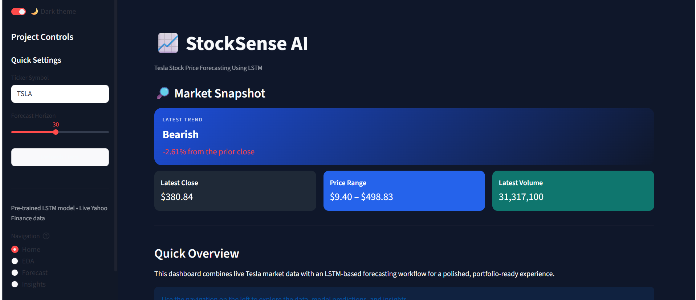
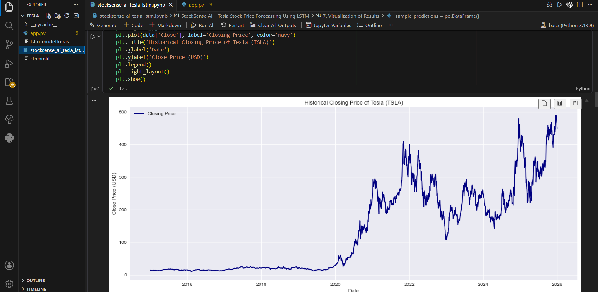
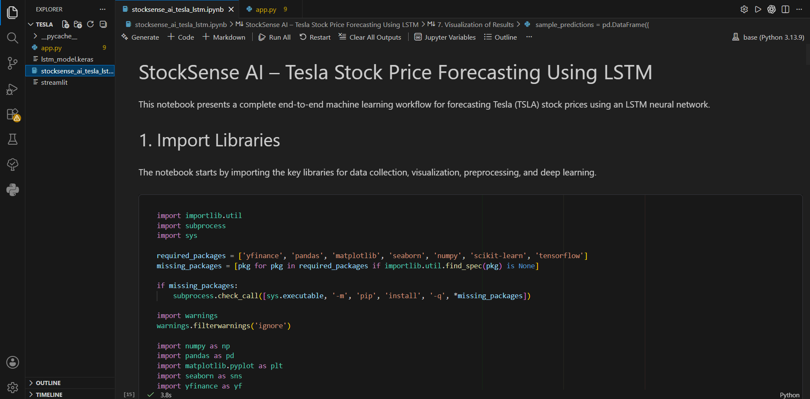
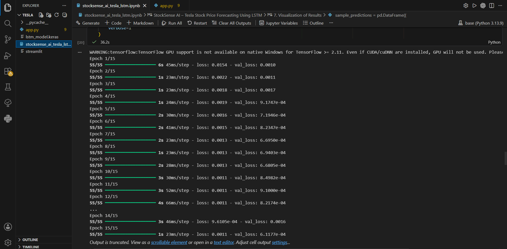
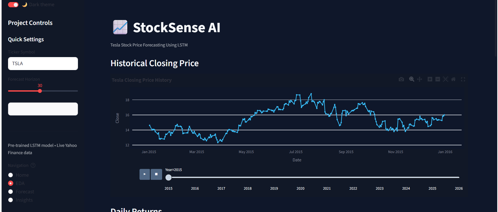

# 📈 Tesla Stock Forecasting Using LSTM 🚀

An **AI-powered Tesla Stock Price Forecasting** project that leverages **Long Short-Term Memory (LSTM)** Deep Learning to predict future Tesla stock prices. This project includes an interactive **Streamlit Dashboard** for visualizing stock trends, predictions, and model performance.

---

## ✨ Project Highlights

✅ Live Tesla Stock Data from Yahoo Finance  
✅ Exploratory Data Analysis (EDA)  
✅ Data Preprocessing & Feature Scaling  
✅ LSTM Deep Learning Model  
✅ Time Series Forecasting  
✅ Model Evaluation (MAE, MSE, RMSE)  
✅ Interactive Streamlit Dashboard  
✅ Professional Data Visualizations  
✅ Download Prediction Results

---

## 🛠️ Technologies Used

- 🐍 Python
- 🧠 TensorFlow & Keras
- 📊 Pandas
- 🔢 NumPy
- 📈 Plotly
- 📉 Matplotlib
- 🤖 Scikit-learn
- 🌐 Streamlit
- 💹 Yahoo Finance (yFinance)

---

## 📂 Project Workflow

1️⃣ Download Tesla stock data from Yahoo Finance

2️⃣ Perform Exploratory Data Analysis (EDA)

3️⃣ Preprocess the data

4️⃣ Scale data using MinMaxScaler

5️⃣ Create sequences for LSTM

6️⃣ Train the Deep Learning model

7️⃣ Evaluate the model using MAE, MSE & RMSE

8️⃣ Forecast future stock prices

9️⃣ Visualize results in Streamlit

---

# 📸 Project Screenshots

## 🏠 Dashboard



---

## 📈 Historical Stock Price



---

## 📊 Tesla Stock Dataset



---

## 🧠 LSTM Model Training



---

## 💹 Stock Price Prediction



---

# 📊 Model Evaluation

The model performance is evaluated using:

- 📌 Mean Absolute Error (MAE)
- 📌 Mean Squared Error (MSE)
- 📌 Root Mean Squared Error (RMSE)

These metrics help evaluate the forecasting accuracy of the LSTM model.

---

# 🚀 Features

- 📈 Historical Tesla Stock Analysis
- 🤖 LSTM-Based Price Prediction
- 📊 Interactive Plotly Charts
- 📉 Moving Average Analysis (50-Day & 200-Day)
- 📋 Prediction Results Table
- 📥 Download Predictions as CSV
- 🌙 Modern Streamlit Dashboard
- 🔄 Automatic Data Fetching using Yahoo Finance

---

# 📁 Project Structure

```text
Tesla-Stock-Forecasting-LSTM/
│
├── app.py
├── stocksense_ai_tesla_lstm.ipynb
├── requirements.txt
├── README.md
├── models/
│   └── lstm_model.keras
├── screenshots/
│   ├── historical.png
│   ├── stock_home.png
│   ├── Tesla_data.png
│   ├── model_train.png
│   └── price_data.png
```

---

# ▶️ How to Run

### Clone the Repository

```bash
git clone https://github.com/yourusername/Tesla-Stock-Forecasting-LSTM.git
```

### Install Dependencies

```bash
pip install -r requirements.txt
```

### Run the Streamlit App

```bash
streamlit run app.py
```

---

# 🎯 Future Enhancements

- 📈 Multi-Stock Prediction
- 📊 Technical Indicators (RSI, MACD)
- 🔔 Buy/Sell Signal Generation
- 📱 Mobile-Friendly Dashboard
- 🤖 Sentiment Analysis Integration

---

# 👨‍💻 Author

**Dhivyadharsrini S**

📧 AI & Machine Learning Enthusiast  
🚀 Passionate about Deep Learning, Data Science & Intelligent Analytics

---

## ⭐ If you found this project helpful, don't forget to ⭐ Star the repository!
